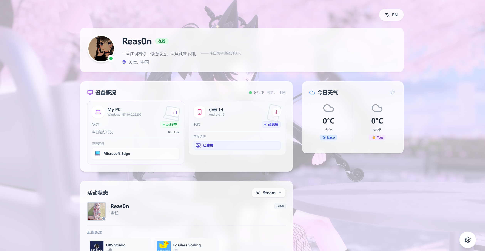

# Re_status

个人状态展示网站，前后端一体的 Node.js 应用。支持 Steam、Bilibili、设备监控、天气信息等状态展示，内置多平台启动脚本和数据采集器。



## 功能亮点

- 实时状态：Steam / Bilibili / 天气
- 设备监控：PC 与移动端在线状态、当前应用、今日使用时长 Top10
- 自动适配：前端自动识别访问地址，API 与 WebSocket 无需手工配置
- 多端启动：Windows / Linux / OpenWrt 脚本，支持后台运行与开机自启
- 数据采集：Windows 采集器、Android Auto.js/AutoX.js 脚本

## 目录结构

```
.
├── backend/              # Express 后端与静态资源托管
├── src/                  # React 前端
├── config/               # 站点与平台配置
├── data-collectors/      # 采集器（Windows / Android）
├── scripts/              # 启动脚本（Win / Linux / OpenWrt）
└── dist/                 # 前端构建产物（由 backend 提供静态服务）
```

## 环境要求

- Node.js 18+，npm
- 必需密钥放入 `backend/.env`（可从 `.env.example` 复制）：`API_KEY`、`QWEATHER_KEY`、`STEAM_API_KEY`、`BILIBILI_SESSDATA`（可选）等
- 前端无需单独部署，后端会托管 `dist`

## 快速开始

```bash
# 安装依赖（根目录）
npm install

# 复制并填写后端环境变量
cd backend
cp env.example .env
# 填写 API_KEY / QWEATHER_KEY / STEAM_API_KEY 等
```

## 部署与启动脚本

推荐使用 `scripts/` 下的启动脚本：

- Windows：`start.bat silent`，（支持安装开机自启）
- Linux：`./start.sh start`，可安装 systemd 服务
- OpenWrt：`./start-openwrt.sh start`，支持 init.d 自启动

更多细节见 `scripts/README.md`。

## 数据采集器（可选）

- Windows：`data-collectors/windows-collector`，依赖 Node.js，支持隐藏运行与开机自启
- Android：`data-collectors/android-collector/Restatus.js`，适配 Auto.js / AutoX.js

两者都需在配置中填写与后端一致的 `API_KEY`，且正确指向后端地址。详见对应子目录 README。

## API 概览

- 健康检查：`GET /api/health`
- 状态：`GET /api/status/steam`、`/bilibili`、`/weather`、`/device`
- 设备上报：`POST /api/report/device`，WebSocket `/ws`
- 统计：`GET /api/usage/today`、`GET /api/stats/today`
- 配置：`GET /api/config/platforms`、`GET/PUT /api/profile`、`POST /api/profile/upload`

## 配置入口

- `CONFIG_GUIDE.md`：全局配置说明
- `backend/README.md`：后端与环境变量
- `config/README.md`：`platforms.json` / `site.json` 说明
- `scripts/README.md`：多平台启动脚本
- `data-collectors/README.md`：采集器使用说明
- `backend/QWEATHER_SETUP.md`：和风天气配置

## 安全提示

- 不要提交真实的 `.env`、`config/platforms.json`、`config/site.json`
- `API_KEY` 必填且应与采集器保持一致；建议定期轮换
- 生产环境建议加 HTTPS 与反向代理

## 许可证与贡献

- 许可证：MIT
- 欢迎提交 Issue / PR 参与改进
